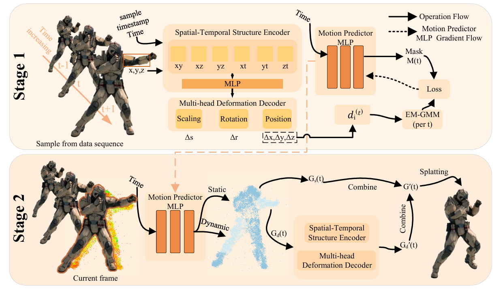

# Motion-Aware Selective 4D Gaussian Splatting for Efficient Dynamic Scene Reconstruction


[Jun Wang]<sup>1</sup>, Shaochen Zhao<sup>1</sup>, Qi Liu<sup>1</sup>, Fanghui Zhang<sup>1</sup>, [Chunxiao Li](mailto:chunxiaol@henu.edu.cn)<sup>1✉</sup>, [Shunzhou Wang](mailto:shunzhouwang@163.com)<sup>1✉</sup>

<sup>1</sup> School of Artificial Intelligence, Henan University, Zhengzhou 450046, China

✉ Corresponding Authors.

## Pipeline
<p align="center">

</p>

## Environmental Setups

Our codebase is built upon [4DGS](https://github.com/hustvl/4DGaussians). Please follow their environment setup first.

```bash
git clone https://github.com/your-repo/MAS-4DGS.git
cd MAS-4DGS
git submodule update --init --recursive
conda create -n MAS4DGS python=3.7
conda activate MAS4DGS

pip install -r requirements.txt
pip install -e submodules/depth-diff-gaussian-rasterization
pip install -e submodules/simple-knn
```

**Additional dependencies** (for GMM-based adaptive labeling):
```bash
pip install scikit-learn
```

In our environment, we use `pytorch=1.13.1+cu116`.

## Data Preparation

We evaluate on two dynamic scene benchmarks: **HyperNeRF** and **Neu3D (N3V)**.

**For HyperNeRF scenes:**
Download scenes from [HyperNeRF Dataset](https://github.com/google/hypernerf/releases/tag/v0.1) and organize them following [Nerfies](https://github.com/google/nerfies#datasets). Pregenerated point clouds by COLMAP are provided [here](https://drive.google.com/file/d/1fUHiSgimVjVQZ2OOzTFtz02E9EqCoWr5/view).

**For Neu3D (N3V) scenes:**
Download from [Plenoptic Dataset](https://github.com/facebookresearch/Neural_3D_Video). Extract video frames and organize as follows:

```
├── data
│   | hypernerf
│     ├── virg
│       ├── broom2
│       ├── vrig-chicken
│       ├── ...
│     ├── misc
│       ├── 3dprinter
│       ├── ...
│     ├── interp
│       ├── peel-banana
│       ├── ...
│   | dynerf
│     ├── coffee_martini
│       ├── cam00
│           ├── images
│               ├── 0000.png
│               ├── 0001.png
│               ├── ...
│       ├── cam01
│           ├── images
│               ├── ...
│     ├── cook_spinach
│     ├── cut_roasted_beef
│     ├── flame_salmon
│     ├── flame_steak
│     ├── sear_steak
```

## Training
### HyperNeRF

```bash
# Prepare point clouds (if not using pregenerated ones)
bash colmap.sh data/hypernerf/virg/broom2 hypernerf
python scripts/downsample_point.py data/hypernerf/virg/broom2/colmap/dense/workspace/fused.ply data/hypernerf/virg/broom2/points3D_downsample2.ply

# Train
python train.py -s data/hypernerf/virg/broom2/ \
    --port 6017 \
    --expname "hypernerf/broom2" \
    --configs arguments/hypernerf/broom2.py
```

### Neu3D (N3V)

```bash
# Preprocess
python scripts/preprocess_dynerf.py --datadir data/dynerf/sear_steak
bash colmap.sh data/dynerf/sear_steak llff
python scripts/downsample_point.py data/dynerf/sear_steak/colmap/dense/workspace/fused.ply data/dynerf/sear_steak/points3D_downsample2.ply

# Train
python train.py -s data/dynerf/sear_steak \
    --port 6017 \
    --expname "dynerf/sear_steak" \
    --configs arguments/dynerf/sear_steak.py
```

## Rendering

```bash
python render.py --model_path "output/hypernerf/broom2/" \
    --skip_train \
    --configs arguments/hypernerf/broom2.py
```

## Evaluation

```bash
python metrics.py --model_path "output/hypernerf/broom2/"
```

## Contributions

**This project is built upon [4DGS](https://github.com/hustvl/4DGaussians).
## Acknowledgement

We sincerely thank the authors of [4DGS](https://github.com/hustvl/4DGaussians), [3DGS](https://github.com/graphdeco-inria/gaussian-splatting), [HexPlane](https://github.com/Caoang327/HexPlane), and [TiNeuVox](https://github.com/hustvl/TiNeuVox) for their excellent open-source contributions. Our codebase is built upon their foundational work.

